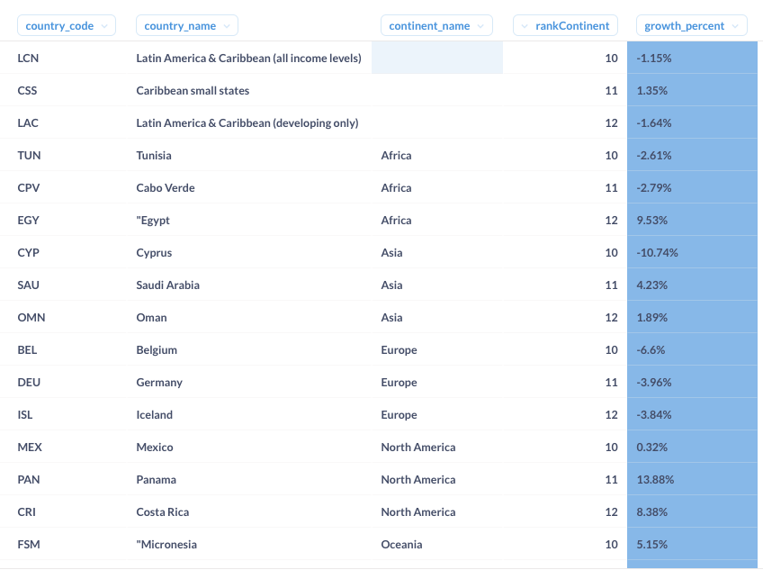
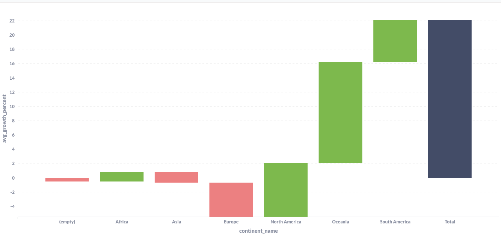
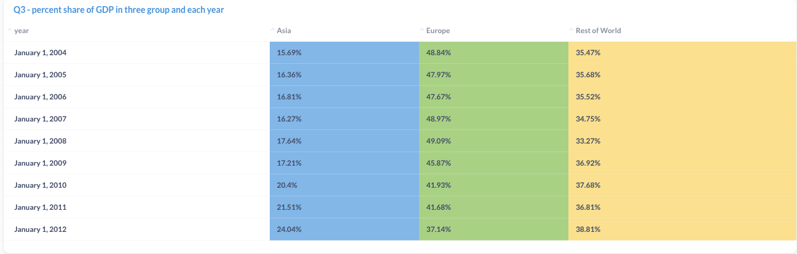
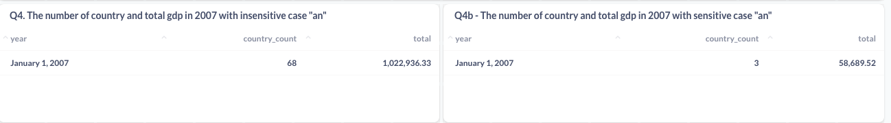
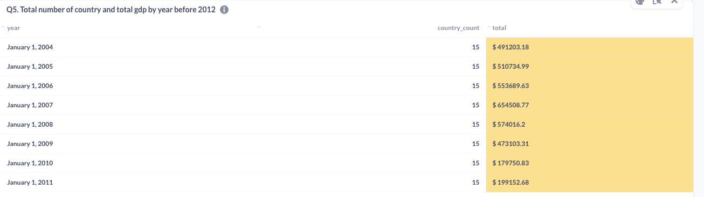
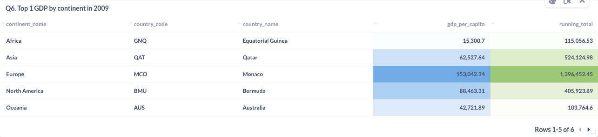
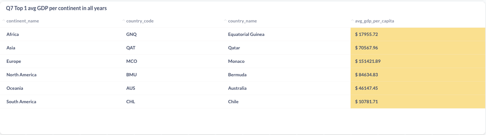

Hi, my name is Tien (David).

In this repository, I will show step by step resolving the problem in Upmesh Analytics Code Challenge. Here we go ! 
1. Data Warehouse: 
- Create schema and table: Utilizing mySQL workbench to create schema and table with its relationships. (I don't define any relationship because it's not required in this case)

    Look  at the ERR diagram below: 
    

    **Countries**: country_code (PK), country_name 

    **Continents**: continent_code (PK), continent_name

    **ContinentMap**: country_code , continent_code 

    **PerCapita**: country_code , year, gdp_per_capita 

    A forward engineering the data structure in [*AnalysisSQL/mysql_db/createSchema.sql*](https://github.com/tatien777/AnalysisSQL/blob/master/mysql_db/createSchema.sql)


- Inset data into database: follow some ways to load data from csv file. [this link](https://www.mysqltutorial.org/import-csv-file-mysql-table/#:~:text=Importing%20CSV%20file%20using%20MySQL%20Workbench&text=Open%20table%20to%20which%20the%20data%20is%20loaded.&text=Review%20the%20data%2C%20click%20Apply,insert%20data%20into%20the%20table.)

    For example: 

    ```DATA LOCAL INFILE '/home/azureuser/dev/AnalysisSQL/analyst-challenge/data_csv/countries.csv' INTO TABLE Countries FIELDS TERMINATED BY ',' ENCLOSED BY '"' LINES TERMINATED BY '\n' IGNORE 1 ROWS; ```

2. Build BI tool with metabase:  

- Setup server on azruze cloud:

    I have used  a linux system with the size like 1cpu and 2 GB Ram.

- Docker for mysql: 

```docker pull mysql```

Read more in [here](https://hub.docker.com/r/mysql/mysql-server). 

- Docker for metabase: 

```docker pull metabase/metabase:lates``` 

Read more in [here](https://www.metabase.com/docs/latest/operations-guide/running-metabase-on-docker.html).

- Accessing to metabase: 

    you can access to my dashboard/report by following the account below:

    http://20.213.15.238:3000/dashboard/1-upmesh-analytics-code-challenge

    Click and access the link above.

    ```user name: test1@example.com ```

    ```password: send to the email submission or asking tientm0409@gmail.com ```

    This email has a full permission to access to many places and write the query/sql in my database.

    


3. Problem & Explanation:

- **Problem 1:** 
    - How to find the country_codes appearing more than once and adjust *country_code* with null or blank value to "F00".
    checking the result with all and distinct value in ContinentMap table. ``` SELECT 
count(*) as total ,count(distinct(country_code)) as distinct_values
FROM ContinentMap ;```

    https://github.com/tatien777/AnalysisSQL/blob/2c7e62e009a4f98a13a05a58fcde45e667300582/solution/problem1.sql

    Full solution in [here](https://github.com/tatien777/AnalysisSQL/blob/master/solution/problem1.sql)

   - Delete the row values appearing more one time in *country_code*: 
   Continuing with the creation of the **ContinentMapDuplicate** table in the preceding example, we now delete and insert into ContinentMap using the logic below.
   
   ```
    Delete From ContinentMap;
    insert into ContinentMap
	select country_code, continent_code from  ContinentMapDuplicate WHERE rowNumber = 1 ;```

- **Problem 2:** 
    list the result ranked 10-12 in each continent by the percent of year-over-year growth descending from 2011 to 2012

    SQL solution in here
    
    https://github.com/tatien777/AnalysisSQL/blob/2c7e62e009a4f98a13a05a58fcde45e667300582/solution/problem2.sql

    
   

    

    I add in a analysis based on this question.

    
     
    **Comment**: According to the bar chart, the percentage change 2012 over 2011 in **Asia and Europe** revealed a falling tendency, but **Africa, North America, Oceania, and South America **exhibited the opposite trend.

- **Problem 3:** 
    Showing the percent share of gdp_per_capita for the following regions:(i) Asia, (ii) Europe, (iii) the Rest of the World.

    My SQL code in here https://github.com/tatien777/AnalysisSQL/blob/2c7e62e009a4f98a13a05a58fcde45e667300582/solution/problem3.sql

    

    **Comment**: From 2004 to 2012, the contribution of Asia to the total gdp (from 15 to 24) increased dramatically, but that of Europe fell considerably throughout the same period (from 48 to 37).

- **Problem 4:**  the count of countries and sum of their related gdp_per_capita values for the year 2007 where the string 'an' (case insensitive) and case sensitive

    My code SQL: https://github.com/tatien777/AnalysisSQL/blob/2c7e62e009a4f98a13a05a58fcde45e667300582/solution/problem4.sql

    
    ** intensive case** : 68 countries 

    ** sensitive case**: 3 countries 

- **Problem 5:**  
sum of gpd_per_capita by year and the count of countries for each year that have non-null gdp_per_capita where (i) the year is before 2012 and (ii) the country has a null gdp_per_capita in 2012. Your result should have the columns:

    My code SQL: https://github.com/tatien777/AnalysisSQL/blob/2c7e62e009a4f98a13a05a58fcde45e667300582/solution/problem5.sql

    

    **Comment**: Over the past eight years, the number of countries has remained constant, but the total gdp product has fluctuated significantly. (these countries without gdp in 2012)
- **Problem 6:** Create a single list of all per_capita records for year 2009, order this list by:continent_name ascending, characters 2 through 4 (inclusive) of the country_name descending,  create a running total of gdp_per_capita by continent_name.Return only the first record from the ordered list for which each continent's running total of gdp_per_capita meets or exceeds $70,000.00 with the following columns:

    My code sql: https://github.com/tatien777/AnalysisSQL/blob/2c7e62e009a4f98a13a05a58fcde45e667300582/solution/problem6.sql

    

    **Comment**: The preceding table reveals a number of intriguing facts, such as the fact that Monaco has the greatest GDP in the world and that North America has the highest GDP as Bermuda (not United States). Nearly half of the world's total GDP was generated by European nations.

- **Problem 7:** Find the country with the highest average gdp_per_capita for each continent for all years. Now compare your list to the following data set. 

    My sql solution: https://github.com/tatien777/AnalysisSQL/blob/2c7e62e009a4f98a13a05a58fcde45e667300582/solution/problem7.sql

rank | continent_name | country_code | country_name | avg_gdp_per_capita 
---- | -------------- | ------------ | ------------ | -----------------
   1 | Africa         | SYC          | Seychelles   |         $11,348.66
   1 | Asia           | KWT          | Kuwait       |         $43,192.49
   1 | Europe         | MCO          | Monaco       |        $152,936.10
   1 | North America  | BMU          | Bermuda      |         $83,788.48
   1 | Oceania        | AUS          | Australia    |         $47,070.39
   1 | South America  | CHL          | Chile        |         $10,781.71

   My result: 
    


Consequently, I have the same value as in the table above for **Chile**, but a different value in *avg_gdp_per_capita* for **Bermuda, Australia, and Monaco**. I have double-checked the average value in excel (spreadsheet) and confirmed that it is the same as my result.

In addition, we have some differences with **Guinea in Africa and Qatar in Asia**. I also validated the same value in Excel using the average value and there are no problem with my result. So, checking your table result please.


Thanks for reading. 