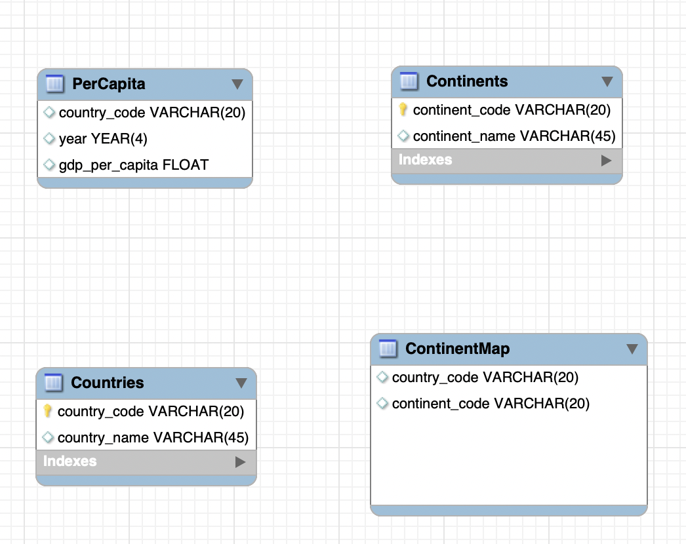

Hello, my name is Tien (David). In this repository, I will show step by step resolving the problem in Upmesh Analytics Code Challenge. Here we go ! 
1. Data Warehouse: 
- Create schema and table: Utilizing mySQL workbench to create schema and table with its relationships. (I don't define any relationship because it's not required in this case)

    Look  at the ERR diagram below: 
    

    **Countries**: country_code (PK), country_name 
    **Continents**: continent_code (PK), continent_name
    **ContinentMap**: country_code , continent_code 
    **PerCapita**: country_code , year, gdp_per_capita 

    A forward engineering the data structure in [*AnalysisSQL/mysql_db/createSchema.sql*](https://github.com/tatien777/AnalysisSQL/blob/master/mysql_db/createSchema.sql)


- Inset data into database: follow some ways to load data from csv file. [this link](https://www.mysqltutorial.org/import-csv-file-mysql-table/#:~:text=Importing%20CSV%20file%20using%20MySQL%20Workbench&text=Open%20table%20to%20which%20the%20data%20is%20loaded.&text=Review%20the%20data%2C%20click%20Apply,insert%20data%20into%20the%20table.)

    For example: 

    ```DATA LOCAL INFILE '/home/azureuser/dev/AnalysisSQL/analyst-challenge/data_csv/countries.csv' INTO TABLE Countries FIELDS TERMINATED BY ',' ENCLOSED BY '"' LINES TERMINATED BY '\n' IGNORE 1 ROWS; ```

2. Build BI tool with metabase:  

- Setup server on azruze cloud:

I have used  a linux system with the size like 1cpu and 2 GB Ram.

- Docker for mysql: 

```docker pull mysql```

Read more in [here](https://hub.docker.com/r/mysql/mysql-server). 

- Docker for metabase: 

```docker pull metabase/metabase:lates``` 

Read more in [here](https://www.metabase.com/docs/latest/operations-guide/running-metabase-on-docker.html).

3. Problem & Explanation:

- Problem 1. 
    - How to find the country_codes appearing more than once and adjust country_code with null or blank value to "F00".
    ```USE GlobalDataset;
#question1 
 ##have a quick look distinct values in tables 
SELECT 
count(*) as total ,count(distinct(country_code)) as distinct_values
FROM GlobalDataset.ContinentMap ;


WITH ContinentMapDuplicate as (SELECT 
(case when country_code = "" or country_code is null then "FOO" else country_code end) as country_code,
continent_code , RowNumber
FROM (
SELECT 
*
,ROW_NUMBER() OVER (
PARTITION BY country_code
ORDER BY country_code) AS rowNumber
FROM GlobalDataset.ContinentMap
WHERE TRUE 
ORDER BY country_code , 3 ASC
 ) as source 
 WHERE TRUE```


